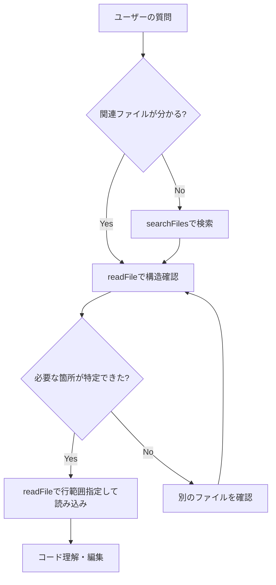

# AIコンテキスト圧縮・検索機能の実装

## 概要

AIのコーディング支援機能において、コンテキストの効率的な管理と圧縮機能を実装しました。
クライアント側（JavaScript）で処理を行い、サーバー負荷を軽減しながら、AIが必要な情報のみを段階的に取得する「on-demand方式」を採用しています。

## 実装内容

### 1. searchFilesツールの追加

**目的**: プロジェクト内のファイルを効率的に検索し、AIが対象を絞り込んでから詳細を読み込めるようにする

**機能**:
- ファイル名検索、ファイル内容検索、または両方に対応
- 正規表現検索と部分一致検索をサポート
- ファイルパターンフィルタリング（例: `*.php`, `*.js`）
- コンテキスト行付きのマッチ結果表示（前後2行）
- 最大検索結果数の制限（デフォルト50件）

**実装場所**:
- `js/modules/ai/toolDefinitions.js` - ツール定義
- `js/modules/ai/ai_tools/fileEditor.js` - 実装関数 `searchFiles()`
- `js/modules/ai/ai-tool.js` - ツール呼び出しハンドラー

**使用例**:
```javascript
searchFiles("function createUser", {
    searchIn: "content",
    regex: false,
    filePattern: "*.php",
    maxResults: 20,
    contextLines: 2
});
```

**戻り値**:
```json
{
    "success": true,
    "query": "function createUser",
    "filesSearched": 45,
    "resultsCount": 3,
    "results": [
        {
            "file": "/api/user.php",
            "matchType": "content",
            "matchCount": 1,
            "matches": [
                {
                    "line": 25,
                    "content": "function createUser($name, $email) {",
                    "context": [
                        { "lineNum": 23, "content": "// ユーザー作成", "isMatch": false },
                        { "lineNum": 24, "content": "", "isMatch": false },
                        { "lineNum": 25, "content": "function createUser($name, $email) {", "isMatch": true },
                        { "lineNum": 26, "content": "    global $db;", "isMatch": false },
                        { "lineNum": 27, "content": "    // ...", "isMatch": false }
                    ]
                }
            ]
        }
    ]
}
```

### 2. readFileに行範囲制限を追加

**目的**: 大きなファイルを全て読み込まず、必要な部分のみを取得してコンテキストを節約

**新パラメータ**:
- `startLine` (integer, optional): 読み込み開始行（1-indexed）
- `endLine` (integer, optional): 読み込み終了行（1-indexed）
- `maxLines` (integer, optional, default: 100): 最大読み込み行数

**動作**:
1. **行範囲指定あり**: 指定された範囲のみを返す
2. **行範囲指定なし + ファイルが100行以下**: 全内容を返す
3. **行範囲指定なし + ファイルが100行超**: 構造要約（クラス・関数一覧）のみを返す

**実装場所**:
- `js/modules/ai/toolDefinitions.js` - パラメータ定義更新
- `js/modules/ai/ai_tools/fileEditor.js` - `readFile()` 関数更新
- `js/modules/ai/ai-tool.js` - パラメータ渡し処理追加

**使用例**:
```javascript
// 全体の構造を取得（大きなファイルの場合）
readFile("api/user.php");

// 特定の行範囲を取得
readFile("api/user.php", { startLine: 20, endLine: 50 });
```

**大きなファイルの戻り値例**:
```json
{
    "success": true,
    "compressed": true,
    "structureOnly": true,
    "structure": {
        "language": "php",
        "classes": [
            { "name": "UserManager", "line": 10 },
            { "name": "UserValidator", "line": 150 }
        ],
        "functions": [
            { "name": "createUser", "line": 25 },
            { "name": "deleteUser", "line": 80 }
        ],
        "methods": [
            { "name": "__construct", "line": 12, "visibility": "public" },
            { "name": "validate", "line": 152, "visibility": "public" }
        ],
        "summary": "2 classes, 2 functions, 2 methods"
    },
    "totalLines": 250,
    "message": "api/user.php (全250行) は大きいため構造要約のみ返します。",
    "hint": "特定の部分を読むには: readFile(filename=\"api/user.php\", startLine=1, endLine=100)"
}
```

### 3. コード構造解析機能

**目的**: 大きなファイルの構造（クラス、関数、メソッド）を軽量に抽出

**対応言語**:
- **PHP**: クラス、関数、メソッド（visibility、static修飾子も識別）
- **JavaScript**: クラス、関数（function宣言、アロー関数）、メソッド
- **HTML**: タイトル、script/style/linkタグの数
- **CSS**: セレクター一覧

**実装場所**:
- `js/modules/ai/ai_tools/fileEditor.js` - `extractCodeStructure()` 関数

**処理方法**:
- クライアント側で正規表現を使用（サーバー負荷なし）
- PHPのtoken_get_allは使わず、軽量な正規表現パーサー
- 最大深度5でディレクトリを再帰的に走査

### 4. ツール結果の自動圧縮

**目的**: ツール実行結果が大きい場合に自動的に要約し、履歴に保存するデータ量を削減

**圧縮対象**:
- 2000文字以上のツール結果

**圧縮ルール**:

#### readFileの結果
- **構造情報あり**: 構造情報のみ保持、元の内容は省略
- **構造情報なし**: 冒頭500文字 + 末尾500文字のみ保持

#### searchFilesの結果
- **20件超の結果**: 最初の20件のみ保持、残りは省略
- **各ファイルで5件超のマッチ**: 各ファイル最初の5件のみ保持

#### lsの結果
- **100件超のアイテム**: 最初の50ファイル + 50ディレクトリのみ保持

**実装場所**:
- `js/modules/ai/ai-chat.js` - `compressToolResult()` 関数

**圧縮統計**:
```javascript
// コンソールに圧縮統計を出力
Tool result compressed: readFile {
    original: 15420,
    compressed: 1830,
    reduction: "88%"
}
```

### 5. On-Demand読み込みガイダンス

**目的**: AIに効率的なツール使用方法を伝え、不要なデータ取得を防ぐ

**実装方法**:
各ツールの`description`フィールドに以下のガイダンスを追加:

#### readFile
```
大きなファイル（100行超）の場合、パラメータなしでは構造要約（関数/クラス名一覧）のみを返します。
特定の行範囲が必要な場合はstartLineとendLineを指定してください。
効率的な使い方: 
1) まず構造を取得 
2) 必要な部分のみ行範囲指定で読み込み。
```

#### searchFiles
```
効率的な使い方: 
1) まずsearchFilesで該当ファイル/行を特定 
2) readFileで必要な行範囲のみ取得。
大量のファイルを読み込む前に、この検索機能で対象を絞り込むことを推奨します。
```

#### ls
```
ファイル名、タイプ（file/dir）、サイズ、更新日時を返します。
```

**実装場所**:
- `js/modules/ai/toolDefinitions.js` - 各ツール定義の`description`

## On-Demand方式とは

### 概念
AIが最初にファイル一覧や構造のアウトラインのみを取得し、必要に応じて詳細（特定の関数・行範囲）を追加リクエストする方式。

### メリット
1. **初期コンテキストの最小化**: 不要なデータを送信しない
2. **段階的な情報取得**: 会話の進行に応じて必要な情報のみを追加
3. **サーバー負荷の軽減**: クライアント側で処理を完結
4. **トークン効率の向上**: コンテキストウィンドウを有効活用

### 実装例

#### 従来の方式（非効率）
```
AI: readFile("/api/user.php") // 500行全て読み込み
AI: readFile("/api/auth.php") // 300行全て読み込み
AI: readFile("/api/post.php") // 400行全て読み込み
→ 合計1200行、約60KBのコンテキスト消費
```

#### On-Demand方式（効率的）
```
AI: searchFiles("function createUser", searchIn="content", filePattern="*.php")
→ 結果: /api/user.php の25行目にマッチ

AI: readFile("/api/user.php", startLine=20, endLine=50)
→ 必要な30行のみ取得

AI: readFile("/api/user.php") // 構造確認
→ 構造要約のみ返される（クラス・関数一覧）

AI: readFile("/api/user.php", startLine=80, endLine=120)
→ 追加で必要な部分のみ取得

→ 合計約70行、約3.5KBのコンテキスト消費（約17倍効率化）
```

## 使用方法

### AIチャットで自動的に利用可能

ツール機能が有効な場合、AIは自動的に以下のツールを使用できます:

1. **ファイルを検索**: `searchFiles`
2. **ファイルの構造を確認**: `readFile` (行範囲指定なし)
3. **特定の部分を読み込み**: `readFile` (行範囲指定あり)
4. **ファイル一覧を取得**: `ls`

### 推奨ワークフロー



## パフォーマンス

### 圧縮効果の測定

実装により以下の圧縮効果が期待できます:

| ツール | 元のサイズ | 圧縮後 | 削減率 |
|--------|----------|--------|--------|
| readFile (500行) | 25KB | 2KB (構造のみ) | 92% |
| searchFiles (100件) | 15KB | 3KB (20件のみ) | 80% |
| ls (200ファイル) | 8KB | 4KB (100件のみ) | 50% |

### クライアント側処理のメリット

1. **サーバーCPU負荷ゼロ**: 全ての構造解析・検索処理はブラウザで実行
2. **レスポンス速度**: ネットワーク遅延が少ない
3. **スケーラビリティ**: サーバーの処理能力に依存しない

## 今後の拡張案

### 実装済み
- ✅ searchFilesツール
- ✅ readFileの行範囲制限
- ✅ コード構造解析（PHP/JS/HTML/CSS）
- ✅ ツール結果の自動圧縮
- ✅ On-Demandガイダンス

### 将来の検討事項
- ⚠️ キャッシュ機構: 同一ファイルの重複読み込み削減（セッション中のみ有効）
- ⚠️ 段階的ローディングUI: ユーザーに圧縮状況を視覚的に表示
- ⚠️ 圧縮統計ダッシュボード: コンソールで圧縮効果を確認
- ⚠️ 意味的検索（Semantic Search）: キーワードだけでなく意味で検索
- ⚠️ AST解析（より精密な構造抽出）: 外部ライブラリを使わない軽量実装

## トラブルシューティング

### ツールが使えない
- AI設定で「ツール機能を有効にする」がONになっているか確認
- ブラウザのコンソールでエラーが出ていないか確認

### 構造解析がうまくいかない
- 対応言語: PHP, JavaScript, HTML, CSS
- 複雑なコード（動的生成など）は検出できない場合があります
- 正規表現ベースのため、完全性は保証されません

### 検索結果が多すぎる
- `filePattern` でファイルを絞り込む（例: `*.php`）
- `maxResults` を小さくする（例: 20）
- より具体的なキーワードを使う
- 正規表現で精密に検索

### 圧縮が効きすぎる
- `maxLines` を大きくする（例: 200）
- 行範囲を指定して必要な部分を正確に読み込む
- 小さなファイルは自動的に全体が返されます

## 関連ファイル

- `/js/modules/ai/toolDefinitions.js` - ツール定義
- `/js/modules/ai/ai_tools/fileEditor.js` - ツール実装
- `/js/modules/ai/ai-tool.js` - ツール呼び出しハンドラー
- `/js/modules/ai/ai-chat.js` - チャット機能・圧縮処理
- `/api/ai_context_compression.php` - サーバー側圧縮（既存）

## バージョン情報

- 実装日: 2025-12-05
- バージョン: 1.0.0
- 対応ブラウザ: Chrome, Firefox, Safari（ES6+対応）
